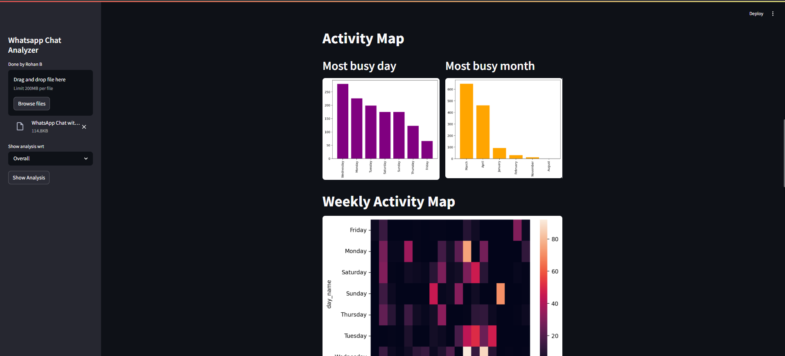

#  WhatsApp Chat Analyser

Rohan.B  1RVU22BSC082  


This Natural Language Processing (NLP) project analyzes exported WhatsApp chat data in .txt format through a user-friendly interface built using Streamlit. Once the chat is uploaded, the system parses and visualizes various insights such as the most active days, chat frequency over weeks, the busiest participants, most used words via word clouds, and emoji usage patterns. The tool offers a visually rich and interactive dashboard, making it useful for casual users and researchers alike to explore communication patterns. It highlights your skills in NLP, data visualization, and frontend integration with Python.

## Installation

1. Clone the repository to your local machine. ``` git clone: https://github.com/Rohan12-stack/Chat-analyser ```
2. Install the required packages using ```pip install -r requirements.txt```.
3. Run processor.py and helper.py
4. Run the app.py by entering "streamlit run app.py" in your IDE terminal.


